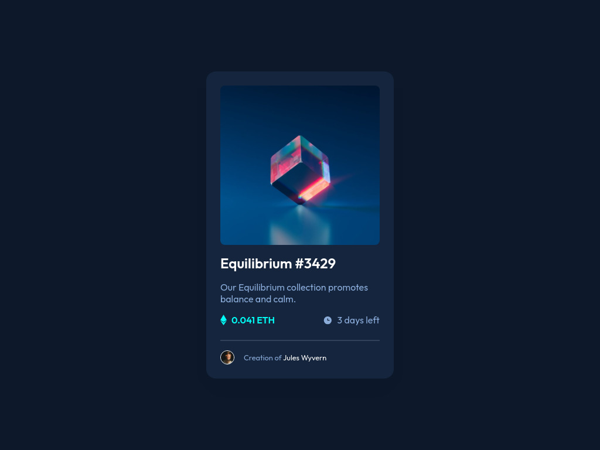

# Frontend Mentor - NFT preview card component solution

This is a solution to the [NFT preview card component challenge on Frontend Mentor](https://www.frontendmentor.io/challenges/nft-preview-card-component-SbdUL_w0U). Frontend Mentor challenges help you improve your coding skills by building realistic projects. 

## Table of contents

- [Overview](#overview)
  - [The challenge](#the-challenge)
  - [Screenshot](#screenshot)
  - [Links](#links)
- [My process](#my-process)
  - [Built with](#built-with)
  - [What I learned](#what-i-learned)
- [Author](#author)

## Overview

### The challenge

Users should be able to:

- View the optimal layout depending on their device's screen size
- See hover states for interactive elements

### Screenshot



### Links

- Solution URL: [NFT preview card component solution](https://www.frontendmentor.io/solutions/nft-preview-card-component-using-html-and-css-Pmvj-kdk2o)
- Live Site URL: [NFT preview card component live site](https://nft-preview-card-component-bayu.netlify.app/)

## My process

### Built with

- CSS custom properties
- Flexbox
- Mobile-first workflow

### What I learned

- **CSS Pseudo-elements**: Used `::before` to create a background effect for the card, enhancing visual appeal.

  ```css
  .card::before {
      content: '';
      position: absolute;
      top: 10%;
      left: 0;
      width: 100%;
      height: 92%;
      border-radius: 0 0 3rem 3rem;
      opacity: 0.4;
      scale: 1.1;
      z-index: -1;
      background: rgba(0, 0, 0, 0.1);
  }
  ```
## Author

- Website - [Bayu Setiawan](https://bayu-setiawan.netlify.app)
- Frontend Mentor - [@bayu275](https://www.frontendmentor.io/profile/@bayu275)
- Linkedin - [Bayu Setiawan](https://www.linkedin.com/in/bayuusetiawan)
